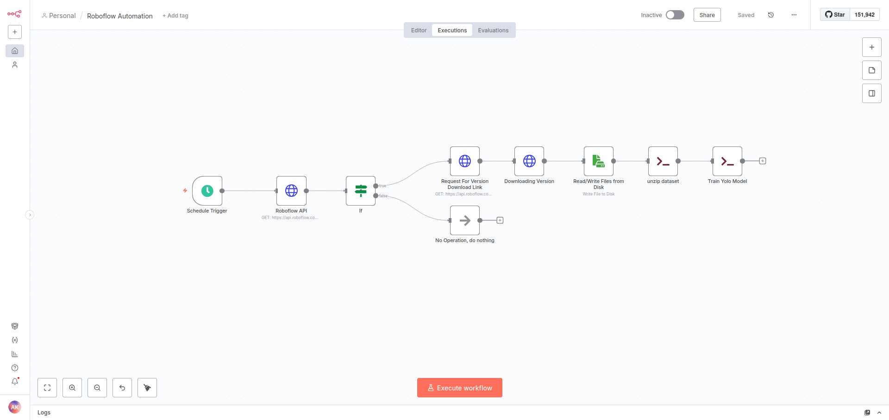

# Roboflow n8n Auto Trainer
Automates dataset syncing and YOLOv8 training using n8n and the Roboflow API.

## Features

- Scheduled check every 20 minutes
- Detects new Roboflow dataset versions
- Downloads and extracts the latest export
- Runs a YOLOv8 training command automatically
- Hands-free end-to-end training pipeline

## Workflow Steps
1. Schedule trigger fires every 20 minutes
2. Roboflow API request fetches dataset metadata
3. Condition checks for updated version
4. Export download link is requested
5. Dataset zip is downloaded
6. File saved to disk
7. Unzip command prepares dataset 
8. YOLO training script runs
